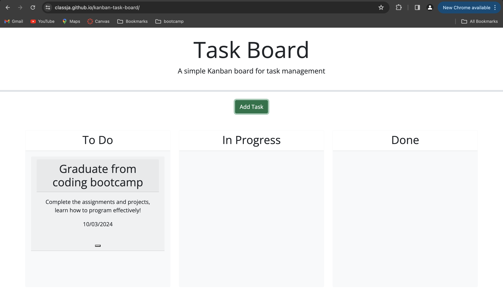

# kanban-task-board

## Description 
This project utilizes the programming languages of HTML, CSS, and javascript to display a functional kanban styled task managing website. The changes made throughout the files are to create a visual collection of the various tasks that have a title, due date, and a description. Each of the tasks can be dragged to 1 of 3 columns: to-do, in-progress, done based on the status of the task. It also has an added feature that alters the color of the task card based on if it is nearing it's due date or beyond it's due date.

## Usage

https://classja.github.io/kanban-task-board/

## Credits 
Sought out assistance from the websites and resources listed below: 
- [x] Referenced this week’s mini-project
- [x] https://stackoverflow.com/questions/27079598/error-failed-to-execute-appendchild-on-node-parameter-1-is-not-of-type-no
- [x] https://stackoverflow.com/questions/42351867/dynamically-adding-text-from-returned-data-into-a-div-with-matching-id
- [x] https://stackoverflow.com/questions/38202399/bring-modal-to-front
- [x] AskBCS
- [x] https://www.youtube.com/watch?v=MBaw_6cPmAw
- [x] TA - Akon  

## License 
MIT
